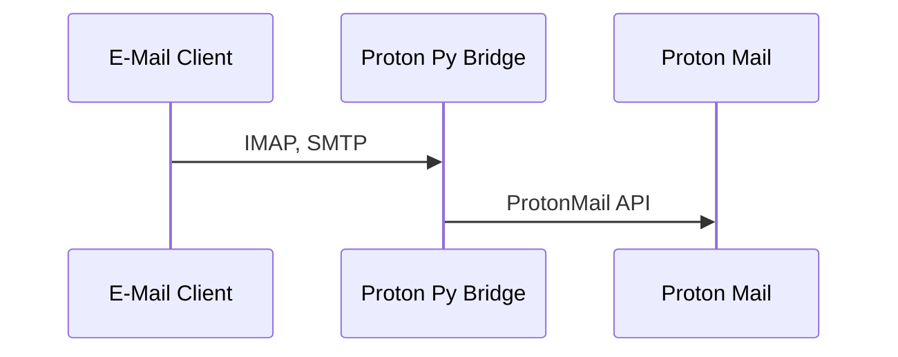

# Proton Py Bridge

[](LICENSE)

## Overview

Proton Py Bridge is a third-party, open-source ProtonMail bridge implemented in Python. It is designed for power users and intended to run on a server. The project supports CardDAV, IMAP, and SMTP, providing compatibility with standard protocols.

### Dependency: Proton Python Client

This code relies on the Proton Python Client. Please note that, as of now, the latest version of the Proton Python Client is not available on PyPI (Python Package Index). To ensure optimal functionality, it is recommended to clone their repository into the project folder.

For more details on the Proton Python Client, like updates and others, refer to the [Proton Python Client repository](https://github.com/protonmail/proton-python-client).

### Inspiration

This project draws inspiration from [Hydroxide](https://github.com/emersion/hydroxide.git), an analogous open-source ProtonMail bridge implemented in Golang by the talented developers at emersion. We acknowledge their innovative work and aim to provide a Python implementation to extend the accessibility and contribution possibilities to the Python community.

For more details on the original Hydroxide project, visit [Hydroxide on GitHub](https://github.com/emersion/hydroxide.git).

## Features

- **Command-Line Interface (CLI):** No graphical user interface (GUI) is provided to ensure compatibility with headless environments.
- **Standard-Compliant:** The project adheres to industry standards, prioritizing compatibility with standard protocols while not catering to specific platforms like Microsoft Outlook.
- **Fully Open-Source:** The entire codebase is available for review and contribution.

Feel free to join our community on IRC: #hydroxide-python on Libera Chat.

## How It Works

Proton Py Bridge acts as a server, translating standard protocols (SMTP, IMAP, CardDAV) into ProtonMail API requests. This allows users to leverage their preferred email clients and tools like `git-send-email` with ProtonMail.



## Setup

### Python

Proton Py Bridge is implemented in Python. Ensure you have a compatible Python environment installed.

### Installation

Clone the repository and install the project:

```shell
git clone --recursive https://github.com/sastatic/hydroxide-python.git
cd hydroxide-python
pip install -r requirements.txt
```

Next, configure the necessary settings and credentials:

```shell
python setup.py configure
```

## Usage

Proton Py Bridge supports multiple modes of operation. It is recommended to use the provided `hydroxide-python serve` command to avoid starting the bridge multiple times.

### SMTP

To run Proton Py Bridge as an SMTP server:

```shell
hydroxide-python smtp
```

Configure your email client with the following settings:

- Hostname: `localhost`
- Port: 1025
- Security: none
- Username: your ProtonMail username
- Password: the bridge password (not your ProtonMail password)

### CardDAV

⚠️ **Warning:** IMAP support is a work in progress. Exercise caution.

Set up an HTTPS reverse proxy to forward requests to Proton Py Bridge:

```shell
hydroxide-python carddav
```

Tested on GNOME (Evolution) and Android (DAVDroid).

### IMAP

⚠️ **Warning:** IMAP support is a work in progress. Exercise caution.

For now, it only supports unencrypted local connections:

```shell
hydroxide-python imap
```

## Contribution

We welcome contributions from the community. Before contributing, please read our [Contribution Guidelines](CONTRIBUTING.md).

## License

This project is licensed under the GNU General Public License Version 3 - see the [LICENSE](LICENSE) file for details.